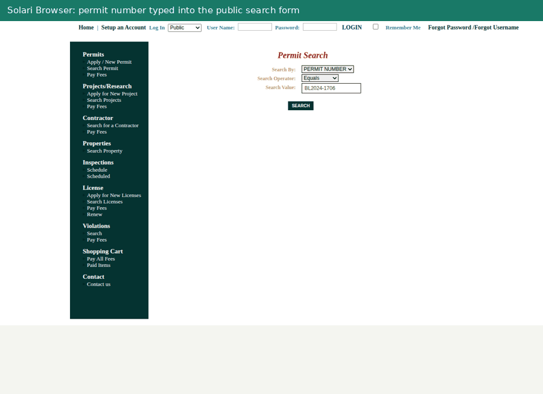

# PermitPilot: watch a building permit through a government portal

Give it a permit number. A Solari Browser searches the city's public permit
portal, opens the record, reads every departmental review and the reviewer's
comment page behind it, lists every attachment with the portal's own labels,
and downloads the applicant's response and the drawing revisions inside the
same session. A Solari Sandbox extracts the PDF text in an isolated VM and is
destroyed before anything reaches a model. A Solari Desktop opens the resulting
tracker in LibreOffice Calc on a real screen. The result is a dated snapshot
that is diffed against the previous run automatically, can be replayed to an
earlier checkpoint, and reads as a coordinator's checklist where every claim
links to the exact source text.

Three real public cases are wired in, two of them on the same portal adapter:

| Command | Case | What it demonstrates |
| --- | --- | --- |
| `npm run demo:pinecrest` | Permit BL2024-1706, Village of Pinecrest, Florida (eTRAKiT) | Reviewer comments, revision downloads with VOID labels, historical replay, AI-linked checklist |
| `npm run demo:atherton` | Permit BP26-00421, Town of Atherton, California (eTRAKiT) | An open permit under review: live status monitoring and change detection on a portal that hides notes and attachments |
| `npm run demo:farmdale` | Farmdale Apartments, Woodburn, Oregon (design review) | Long public documents turned into an evidence-linked timeline, conditions register and decisions |

**Try it on any permit** at
[dineshsai05.github.io/solari-cookbook/try](https://dineshsai05.github.io/solari-cookbook/try):
a hosted copy of this application running inside a Solari sandbox. Pick the
portal, type a permit number, and the report arrives in about two minutes.
Finished example reports are at
[dineshsai05.github.io/solari-cookbook](https://dineshsai05.github.io/solari-cookbook/)
and in [proof/](proof/README.md), which also explains what was redacted.



## Why this needs Solari

- **The portal is a real ASP.NET application.** Search is a postback form,
  review detail pages are session-bound, and the attachment handler answers a
  plain HTTP request for the same URL with 403 while serving the PDF to the
  browser session. The adapter drives the page like a person would, with
  recording turned on, so a reviewer can watch the session in the Solari
  console.
- **Attachments are untrusted files.** Everything downloaded goes to a
  throw-away Solari Sandbox with a pinned `pypdfium2` and no credentials. The
  VM is killed before the model request, so the model only ever sees extracted
  text and the sandbox never idles on the bill.
- **Coordinators live in spreadsheets.** With `--desktop`, the snapshot is
  written to a CSV on a Solari Desktop and opened in LibreOffice Calc on the
  screen, with a screenshot kept as evidence. The same primitive would drive a
  legacy Windows tracker or a project-management desktop app.
- **A coordinator has many permits in flight.** Each run is one bounded
  browser session, one bounded sandbox and, optionally, one bounded desktop.
  Snapshots are plain JSON, so scheduling and fan-out are the caller's problem,
  not the adapter's.

## What a run produces

`artifacts/<timestamp>-pinecrest-live/`:

- `report.html`: overall status separated from review history, review cycles,
  verbatim reviewer comments with the discipline's outcome chain, the
  comment-to-response checklist, attachments with VOID labels, run evidence.
- `snapshot.json`: permit fields, 17 review rows with notes and hashes, 23
  attachments with labels, keys and download hashes.
- `diff.json`: permit fields, review rows and attachment labels that changed
  since the latest earlier completed run of the same case. A repeat run reports
  `changed: false`; the first run records `first_capture`. `--compare DIR`
  picks a specific run, `--no-compare` skips it.
- `replay.json` (with `--replay YYYY-MM-DD`): the event history filtered to
  that date and labelled as a reconstruction.
- `analysis.json`, `model-response.json`: the checked checklist and the raw
  model reply, with token usage.
- `tracker.csv`, and with `--desktop`, `desktop-tracker.png`.
- `documents.json`, `attachments/`, five step screenshots, `manifest.json`,
  `events.jsonl`.

## How it stays honest

- **The model never writes a quotation.** Extracted text is sliced into
  numbered passages. The model may only cite passage IDs; the host inserts the
  original text and rejects unknown IDs. Every quote is then re-checked against
  its page. This proves traceability, not that the summary is right.
- **Coverage is enforced.** The checklist must contain exactly one item for
  every review that has reviewer notes. An `applicant_asserted` item must cite
  an applicant-response document. Duplicates, omissions and unsupported
  assertions stop the run.
- **Status and history are different things.** The permit's overall status
  is one field. Individual rows keep their historical DENIED or INCOMPLETE
  outcomes and are never presented as current problems. Later APPROVED rows in
  the same discipline are shown as a chain, not as proof that a specific comment
  was satisfied.
- **Replays are labelled.** A reconstructed checkpoint says so on every page
  and can never be replayed again from itself.
- **Nothing is written to the portal.** No login, no applicant record, no
  submission. The only form submitted is the public search box.

Known soft spots in the AI layer are recorded in
[cases/pinecrest-review-notes.md](cases/pinecrest-review-notes.md) and
[cases/farmdale-review-notes.md](cases/farmdale-review-notes.md).

## Install

Requires Node 22.8+, npm, a funded Solari account with browser and sandbox
access, and an AIML API key for a model that supports Chat Completions
JSON-schema structured outputs. Python 3.10+ is only needed for the local deck
mode and the Python tests.

```bash
cd applications/permit-pilot
npm install            # versions are pinned in package.json; the cookbook ignores lockfiles
cp .env.example .env
```

```dotenv
SOLARI_API_KEY=your-key
AIML_API_KEY=your-key
AIML_MODEL=openai/gpt-4.1-mini-2025-04-14
```

`npm start -- --doctor` reports which names are configured without printing
values. There is no automatic model fallback.

## Web demo

```bash
npm run serve                  # http://localhost:8080, one job at a time
npm run host                   # same server inside a Solari sandbox on a public preview URL
npm run host -- --status       # is it still up
npm run host -- --stop         # end the sandbox
```

The form takes a portal and a permit number and runs one CLI job per request
with the same guards as the command line, plus a per-address rate limit and a
queue of eight. Any `https://` eTRAKiT origin can be entered; unverified
deployments are labelled as such in the report. Unpinned permits select their
own attachments: every applicant response, the newest drawings, and the VOID
revision each superseded, at most six files and 40 extracted pages.
`PERMITPILOT_WEB_DESKTOP=1` adds the desktop step to web runs;
`PERMITPILOT_CONTACT` prints a feedback address on the form.

`npm run host` ships the working tree (never `.env`, runs or proof) to a
`base` sandbox, writes the credentials into the sandbox's own `.env`, installs,
starts the server and prints a `*.preview.getsolari.com` URL. The URL carries a
one-time token that sets an hour-long cookie, so links inside the app work.
Solari ends the sandbox after about five hours on this account whatever idle
window is requested, so the script stays in the foreground with a keep-alive
and is simply run again to re-host. Hosting the app on the same
infrastructure it drives is deliberate: the sandbox that serves the form
creates its own browser, sandbox and desktop sessions per request.

## Run the portal demos

```bash
npm run demo:pinecrest                         # compares with the latest earlier run automatically
npm run demo:pinecrest -- --replay 2025-03-25 --desktop
npm run demo:atherton                          # open permit, no notes published: monitoring only
npm run demo:pinecrest -- --no-model           # browser and sandbox only
node --import tsx src/portal-cli.ts --case <name>   # any case file under cases/
node --import tsx src/portal-cli.ts --portal pinecrest --permit BL2024-0001      # any permit on a known portal
node --import tsx src/portal-cli.ts --portal https://city-trk.aspgov.com --permit X # any eTRAKiT origin
```

A case file pins the portal origin, the permit number, the expected site
address, and the SHA-256 of any documents the demo downloads. A changed hash
is reported in the snapshot and the report, not hidden. The adapter finds the
portal's own labels for the search dropdowns and the Reviews tab, which differ
between deployments ("PERMIT NUMBER" versus "Permit No", "Reviews" versus
"Reviews(11)").

Pinecrest is finalized, so its runs are historical replays of a closed case
and change detection is exercised by comparing consecutive captures. Atherton
is under review with two review rows still pending, so a later run can detect
a real change. When a portal publishes no reviewer notes or attachments, the
sandbox and the model step are skipped and the report says so.

Verified September 29, 2026: six Pinecrest runs and two Atherton runs, each
about one minute, every comparison reporting no change. The last Pinecrest
checklist request used 3,345 input and 1,276 output tokens. Solari's replay
download returned 404 for every session on this account that day; the session
ID is recorded in each manifest and the run keeps going without the replay.

## Run the document-review demo

```bash
npm run demo:farmdale
npm run demo:farmdale -- --resume artifacts/<previous-run>   # reuse extraction, redo the model step
```

Solari Browser captures the official project page; Solari Sandbox downloads
the three text-rich public PDFs, verifies their pinned hashes and extracts 43
pages; one bounded AIML request returns a timeline, recorded tasks, requested
versus decided changes and questions, all cited by passage ID. The 42 drawing
pages are indexed and linked, not analyzed. Verified September 29, 2026 with
24,207 input and 2,100 output tokens. The delivered example was reviewed by
hand; `scripts/review-farmdale.ts` applies those corrections to a run while
keeping the raw model output.

## Earlier demo: Portland deck application

`npm start -- --project fixtures/generated/incomplete/project.json` runs the
first workflow: four official Portland guidance pages are captured live, the
city's application PDF is verified by hash, synthetic plan PDFs are extracted
and classified, a small coded checklist runs, and an unsigned draft of the
official form is produced. `npm run fixtures` generates the synthetic
incomplete, corrected and unreadable sets. `--mode local --python .venv/bin/python`
runs the same PDF tools with reference excerpts and no Solari or AI. Nothing
synthetic is ever entered into a government account.

## Tests

```bash
npm run typecheck
npm test
npm run fixtures && python3 -m venv .venv && .venv/bin/python -m pip install -r python/requirements.txt
.venv/bin/python -m unittest discover -s python -p 'test_*.py' -v
```

28 TypeScript tests cover the portal parser, dropdown label matching, automatic attachment selection, dynamic case resolution,
attachment key hints, snapshot diffing, replay filtering, latest-run
selection, the tracker CSV, checklist coverage and citation rules, HTML
escaping, the Farmdale evidence validator, the deck checklist, and mocked AIML
transport failures. 6 Python tests cover PDF extraction, encrypted inputs,
form round-trips and overflow rejection. No test makes a network call.

## Limits

- Read-only. Submission, payment, account access and edits to the applicant
  record are out of scope by design.
- One portal family (CentralSquare eTRAKiT, two deployments verified) and one
  Oregon document set. The selectors in `src/portal-etrakit.ts` are specific
  to that portal family; Denton TX and El Dorado County CA deployments were
  probed and publish no review rows at all.
- Text only. Drawings are downloaded and hashed, not interpreted; scanned
  pages need OCR that is not implemented.
- Bounded: 40 attachment pages, 15 MB per file, 160,000 characters of model
  input, one model request with retries disabled.
- A prototype, not a hardened upload service. Do not expose it to the public
  as is.

## Layout

```
cases/            pinned case manifests and review notes
src/portal-*.ts   eTRAKiT adapter, snapshot diff and replay, latest-run lookup, checklist validation, report
src/desktop-tracker.ts  tracker CSV and the Solari Desktop step
src/server.ts     web demo: form, job queue, report serving
src/portal-cases.ts  pinned case files and dynamic portal/permit requests
src/case-*.ts     Farmdale document review
src/passages.ts   passage slicing and citation resolution shared by both
src/sandbox-python.ts  sandbox bootstrap with pinned pypdfium2
python/           fixed extraction tools that run inside the sandbox
scripts/          fixtures, proof bundling, Farmdale corrections, Solari hosting, walkthrough GIF
proof/            sanitized evidence from live runs
tests/            node:test suites
```

## Sources and provenance

Pinecrest: [public permit record](https://pine-trk.aspgov.com/eTRAKiT/Search/permit.aspx?activityNo=BL2024-1706),
qualified with real Solari sessions on September 29, 2026. Reviewer names and
the site address are public record on that page.

Atherton: [public permit record](https://athr-trk.aspgov.com/eTRAKiT/Search/permit.aspx?activityNo=BP26-00421),
found by searching the town's portal for permits applied for after June 1,
2026 and qualified the same day.

Farmdale: [official project page](https://www.woodburn-or.gov/778/Design-Review-DR-25-02---Marion-County-H)
and five public PDFs pinned by hash in `cases/farmdale.json`.

Portland deck: [drawing requirements](https://www.portland.gov/ppd/residential-permitting/decks/prepare/create-detailed-plans),
[file requirements](https://www.portland.gov/ppd/residential-permitting/decks/prepare/prepare-your-files),
[application instructions](https://www.portland.gov/ppd/residential-permitting/decks/prepare/fill-out-your-forms),
[rule-change context](https://www.portland.gov/permitimprovement/code-alignment-project),
and the [official application PDF](https://www.portland.gov/ppd/documents/building-permit-application-building-site-development-demolition-and-zoning-permits/download),
retained unchanged as a reference fixture with SHA-256
`04671f40f528baaaae5fe42f5f6dcfe0b5aa94ec045f2c10429c417b06f4daf9`.

Model pricing used for the cost note: [AIML GPT-4.1 mini](https://aimlapi.com/models/openai-gpt-4-1-mini-2025-04-14),
$0.52 per million input and $2.08 per million output tokens on September 29, 2026,
so a Pinecrest checklist costs well under a cent and a Farmdale review about two cents,
excluding Solari time.

Built inside the official Solari cookbook, cloned at
`a435d2ac5ae87bdf9ee4f6c91f97da9501359560`.

### Guided public demo and safe live trial

The permanent entry point is https://dineshsai05.github.io/solari-cookbook/try.html.
It includes instructions, a six-stage recorded walkthrough, source reports, downloads,
and feedback by email. Recorded evidence is explicitly labelled. `public/live.json`
points to a temporary live host; the page checks expiration and health before offering
it. An offline host never removes access to the examples.

`node --import tsx scripts/publish-demo.ts` publishes the permanent page. The existing
`npm run host -- --publish-redirect` command now updates the guided page and live
configuration instead of replacing the page with an unconditional redirect.

The public runner accepts only configured Pinecrest/Atherton portals. API keys stay
on the server. Admission is serialized and the global budget is persisted before a
worker starts, so concurrent requests, forged forwarding headers and restarts cannot
reset it. Defaults: 10 captures per rolling 24 hours, 5 per socket address per hour,
8 queued, one active, 10-minute timeout. Reverse-proxied users may share the hourly
allowance because untrusted forwarding headers are intentionally ignored. A limit
counts attempts, including failures; it is a run cap, not a dollar-denominated budget.

- `PERMITPILOT_DAILY_LIMIT`: integer 1–100; default 10.
- `PERMITPILOT_LIVE=0`: pause new live captures.
- `PERMITPILOT_DATA_DIR`: persistent writable directory for jobs and budget.
- `PERMITPILOT_CONTACT`: visible feedback contact.

Completed report links survive a process restart when the data directory survives.
Interrupted jobs are marked failed and are never automatically rerun. Only explicitly
allowed artifacts are served; job records, email addresses and worker logs are private.
Reports are link-accessible, not authenticated private workspaces. Do not process
confidential material through this public trial.

### Durable hosting boundary

Solari's current sandbox host is a temporary trial (approximately five hours), not
production web hosting. Jobs and the budget are local to that host and are lost when
its filesystem is destroyed. Do not claim always-on monitoring or permanent report
storage. PostgreSQL mode and an authenticated operator task workspace are available for durable deployments (see below). The public Solari trial remains in filesystem mode.

For a durable single-instance deployment, the Dockerfile runs as a non-root user and
exposes port 8080. Build it locally, provide the existing API environment variables as
secrets, and mount a persistent volume at `/data`. Put it behind an HTTPS reverse proxy.
Only one server process may use a data directory: admission and filesystem locking
are process-local. Back up that volume; restoring an older backup can restore an older
budget too. PostgreSQL mode persists jobs, admission and task edits transactionally, but deliberately grants one runner a session advisory lock. Horizontal scaling is not supported. No new hosting subscription is provisioned by these
scripts. Do not republish/rehost automatically to bypass run limits.

### Regression checks

`npm run typecheck && npm test` includes a real HTTP-server test with a fake worker.
It verifies concurrent admission, forged headers, restart recovery, persistent caps,
artifact restrictions and browser-script syntax without calling paid APIs. Unit tests
cover replay milestones, same-name attachment replacements, bounded revision pairs
and disclosure of unread pages. `scripts/refresh-proof-reports.ts` re-renders historical
proof with current disclosures without pretending to recapture the portal.

### PostgreSQL and the private workspace

Set `DATABASE_URL` and a random `PERMITPILOT_ADMIN_KEY` of at least 32 characters to
use PostgreSQL mode. Start the app and open `/workspace`. The workspace key stays in
browser-tab memory; it is never embedded in a page, URL or browser storage. Reload
or lock the workspace to clear it. Use HTTPS on a real deployment. This is a single
operator workspace, not multi-tenant SaaS or individual employee authentication.

The workspace lists the last 200 captures, links source reports, and lets the
operator create manual follow-up tasks with an owner, due date, notes and state.
Tasks do not change portal status. Every create/edit is audited. Revision numbers
reject stale edits with HTTP 409. Only the operator key can list or change tasks;
public report links do not expose task notes or the capture email address.

PostgreSQL holds capture metadata, the durable queue, daily admission counts and
tasks. New completed reports are also archived in PostgreSQL, including screenshots and the activity trail. Local `/data` files are a cache for those reports. Existing runs created before database archiving still need their original report volume. A process restart resumes queued captures; an interrupted
running capture is marked failed rather than automatically spending more credits.
The runner holds a database session lock, keeps a second server in standby during deployment and stops
its local worker if the lock connection is lost. Admission is serialized in a
transaction and committed before execution. Do not use transaction-pooling proxies
for the session-lock connection; use a direct PostgreSQL connection.

`compose.yaml` provides a non-root app and PostgreSQL 17 with persistent volumes,
health checks and restart policies. Its HTTP port binds only to localhost for an
HTTPS reverse proxy. Set `POSTGRES_PASSWORD` to a random URL-safe value and set the
operator key in your ignored environment file. Live calls default off in Compose;
set `PERMITPILOT_LIVE=1` only with valid API credentials and a deliberate run limit.
Use `docker compose --env-file <private-env-file> up -d --build`. Keep the environment
file outside Git. Back up PostgreSQL and the report volume together. Do not use
`docker compose down -v` on a real deployment; it removes persisted data.

Existing filesystem-only runs are not automatically imported into PostgreSQL.
Keep their original host/data directory available when migrating. The database
schema currently uses additive initial table creation; future breaking schema
changes will require versioned migrations.

Database integration tests run only with `PERMITPILOT_TEST_DATABASE_URL` pointing
at a **disposable test database**: the test resets PermitPilot tables there. They
never use `DATABASE_URL`. The suite checks budget concurrency, duplicate-runner
rejection, queue recovery, task persistence, authorization and conflicting edits.


### Free Render + Neon deployment

Use a **Free Web Service**, the `permit-pilot` branch and root directory
`applications/permit-pilot`. Select the Docker runtime, Dockerfile `./Dockerfile`,
and Docker context `.`. Leave Docker Command empty. Set the health check to
`/healthz`. No paid disk, background worker or Render Postgres service is needed.
Use only one instance. During a rolling deployment the new server reports healthy with `standby: true`
and live captures disabled. After Render stops the old process, the new server
acquires the runner lock, restores the queue and begins accepting requests. Standby
servers do not restore or execute jobs. Do not enable multiple replicas.

Copy these values from the private local `.env` into Render environment settings:
`DATABASE_URL` (Neon direct connection with SSL, pooling disabled),
`PERMITPILOT_ADMIN_KEY`, `SOLARI_API_KEY`, `AIML_API_KEY`, `AIML_MODEL`.
Set `PERMITPILOT_LIVE=0` until the deployed health and private workspace are checked;
then set it to `1` for the public trial. Set `PERMITPILOT_DAILY_LIMIT=10`,
`PERMITPILOT_WEB_DESKTOP=0` and `PERMITPILOT_DATA_DIR=/data`.
Never upload the `.env` file to Git or paste its contents in an issue.

Free hosting is not always-on: Render sleeps after inactivity. Neon free compute
and storage are quota-limited too. Our single-runner connection heartbeat consumes
Neon compute while the web process is awake. Live browser and AI work still uses
Solari/AIML credits. Do not use keep-alive pings to prevent free-service sleep.

The archive is bounded at 25 MiB per uncompressed file, 20 MiB compressed per run,
and 100 MiB compressed across all reports. This is an application payload ceiling,
not a guarantee of total PostgreSQL disk size; indexes, WAL and other tables consume
additional storage. Storage failures mark the run failed rather than claiming a
permanent report exists. No old reports are deleted automatically. Private worker
logs, job email and downloaded source attachments are excluded from the archive.
The HTTP artifact allowlist and session-ID redaction apply after database recovery.

After Render provides the HTTPS URL, update the landing page's live-host configuration
and free-host cold-start messaging before announcing fresh captures as available.
